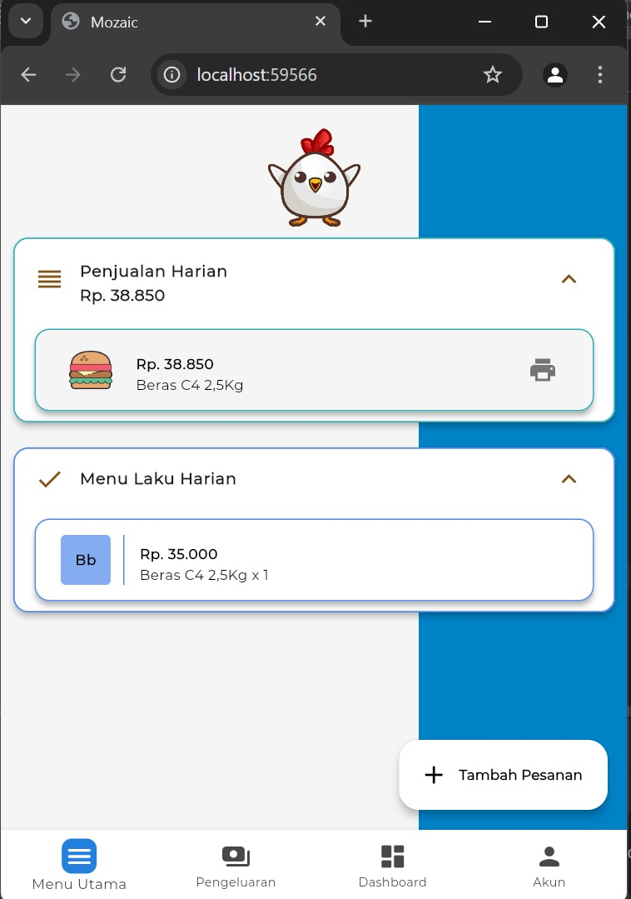
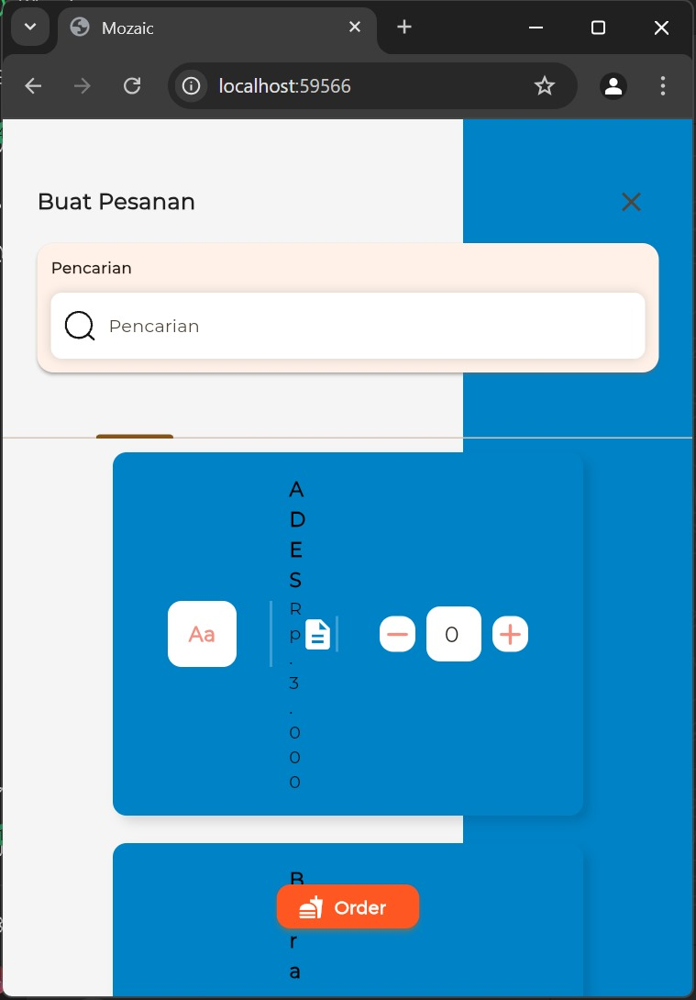
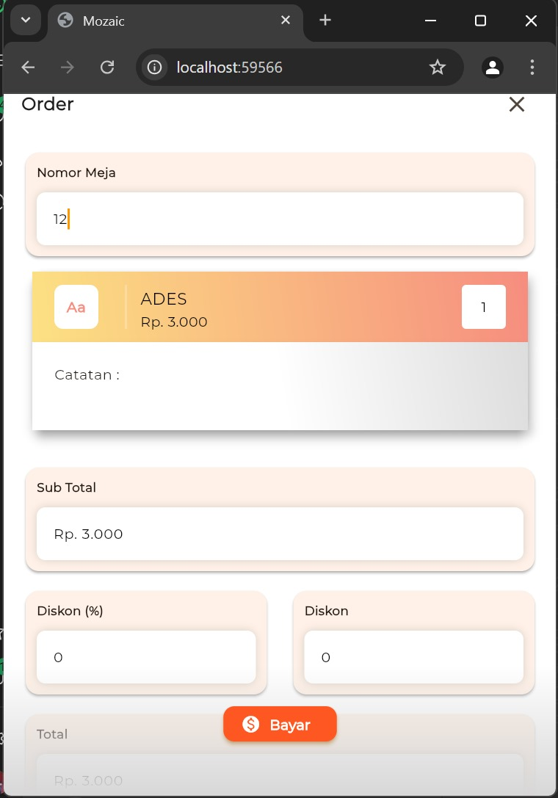
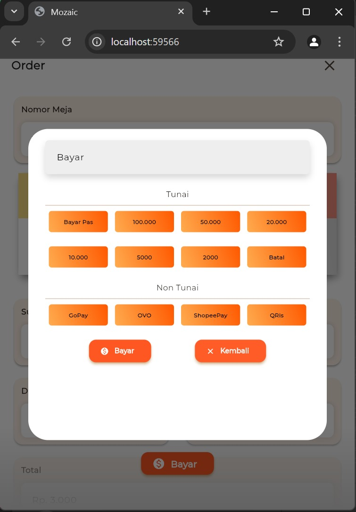
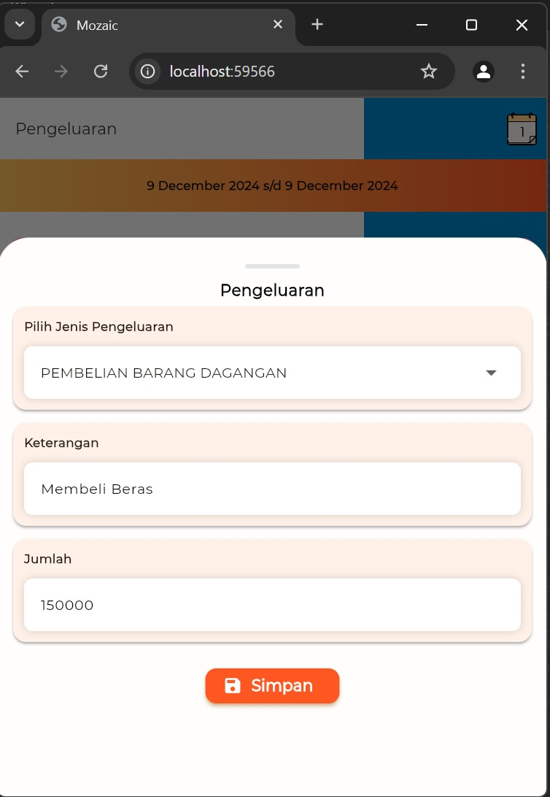
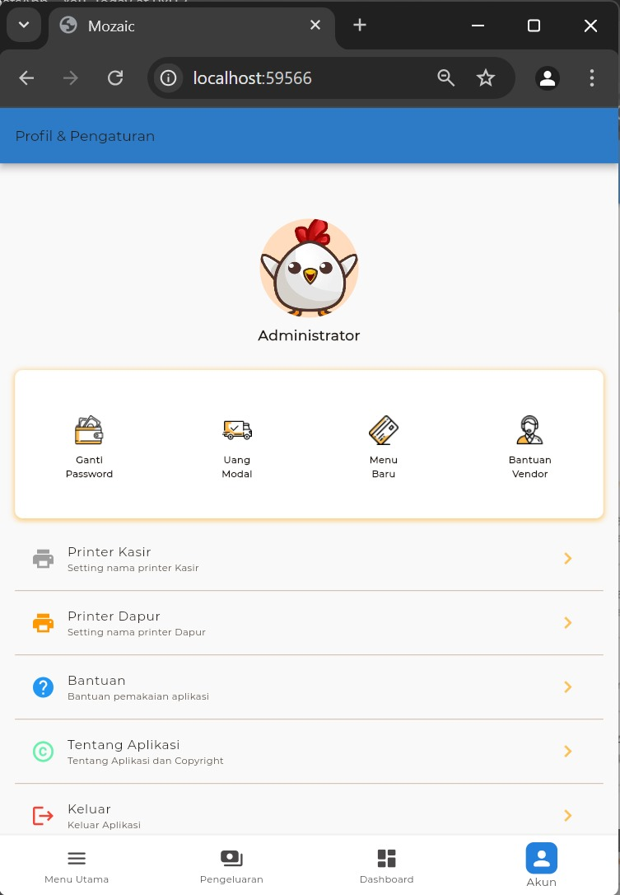

# 💸 Kasir Flutter App

Aplikasi kasir modern berbasis Flutter yang simple, cepat, dan efisien. Dirancang untuk kebutuhan UMKM, toko retail, dan warung kecil hingga menengah. Built with ❤️ by Azza0x1a.

---

## 🚀 Features

- 📦 Manajemen Produk
- 🧾 Pencatatan Transaksi Penjualan
- 📊 Riwayat & Laporan Penjualan Harian
- 👨‍💼 Manajemen Pengguna (Kasir/Admin)
- 🖨️ Dukungan Print Struk (thermal)
- ☁️ Siap Integrasi ke Firebase / Database Lokal
- 🌓 UI Simple + Dark Mode Support
- ⚙️ Responsive Layout (HP & Tablet)

---

## 📸 Screenshots









---

## 🛠️ Teknologi yang Digunakan

- [Flutter](https://flutter.dev/) (Dart)
- Provider / GetX (state management)
- Local DB: `sqflite` / Cloud DB: `Firebase`
- Export PDF: `pdf` package
- Responsive UI: `flutter_screenutil` / Custom

---

## 📦 Install & Run

```bash
git clone https://github.com/azza0x1a/kasir_flutter_app.git
cd kasir_flutter_app
flutter pub get
flutter run
